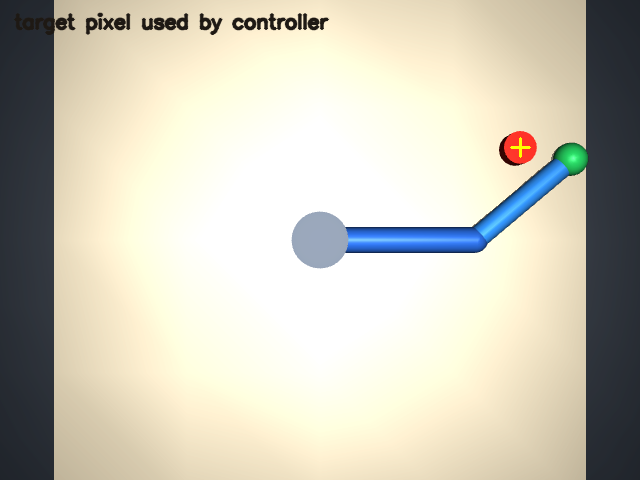

# Camera-based reaching in MuJoCo

A small robotics demo with a clear perception-to-action loop:

1. MuJoCo renders an overhead RGB camera view of a tabletop and a red target.
2. OpenCV detects the target centroid from pixels.
3. A pinhole camera model projects that pixel onto the table.
4. Two-link inverse kinematics turns the estimated point into joint targets.
5. MuJoCo runs the arm, and ground truth is used only to score the final error.



[Watch the clean open-loop baseline](assets/reaching_demo.mp4)

The scene and target positions are generated locally. The project downloads no
robot datasets, pretrained models, or external simulator assets.

## Run

```bash
uv venv --python 3.12
uv pip install -e '.[dev]'
uv run pytest
uv run visual-servo-demo --episodes 20 --seed 7
uv run visual-servo-demo --controller image_feedback --episodes 20 --seed 7
uv run visual-servo-benchmark --seeds 5 --episodes-per-seed 20
```

The command writes `artifacts/results.json`, `artifacts/camera_view.png`, and
`artifacts/reaching_demo.mp4` (when the local OpenCV build supports MP4 output).
The JSON records every target's camera pixel, estimated table position, final
end-effector error, and success. Ground-truth target coordinates are included
only for evaluation; the controller estimates the target from the rendered
image.

## Video demos

The gallery includes paired controller examples, a successful high-noise run,
a combined noise and calibration-error run, and one transparent failure case.
Each clip is rendered at 640×480 and 30 fps with the controller, sensor
condition, pixel error, and final reaching result overlaid.

| Demo | What it shows |
| --- | --- |
| [Clean open loop](assets/demos/open_loop_clean.mp4) | One target projection followed by one IK motion command. |
| [Clean image feedback](assets/demos/feedback_clean.mp4) | Repeated pixel-error corrections with no injected sensor error. |
| [20 px target noise](assets/demos/feedback_noise_20px.mp4) | Image feedback reaching under strong Gaussian pixel noise. |
| [Noise and +5° FOV error](assets/demos/feedback_noise_and_fov_error.mp4) | Feedback with both sensor noise and a camera-model calibration error. |
| [High-noise failure](assets/demos/feedback_high_noise_failure.mp4) | A recorded benchmark failure that reaches the motion-update limit. |

Regenerate the gallery with:

```bash
uv run python scripts/generate_demo_gallery.py
```

To record a specific episode from a seeded batch, select it with
`--video-episode-index`. For example, this saves seed 3, episode 5 from the
20 px-noise condition:

```bash
uv run visual-servo-demo --controller image_feedback --pixel-noise-std-px 20 \
  --episodes 20 --seed 3 --video-episode-index 5 \
  --output-dir artifacts/high-noise-case
```

The benchmark compares two controllers on identical seeded target sequences:
`open_loop` projects one target detection into table coordinates and solves
inverse kinematics; `image_feedback` repeatedly compares the red target and
green end-effector marker in the image and applies a bounded damped-Jacobian
joint update. It requires two consecutive image-space checks inside an 8 px
tolerance before stopping, or stops after 20 motion updates. It estimates the
stationary target center from up to three recent detections using a
coordinate-wise median, which suppresses isolated pixel outliers. Both
controllers start from the same joint pose.

Seven conditions test clean sensing, Gaussian target-pixel noise, and camera
field-of-view calibration errors. Pixel noise is injected after target
detection at each observation; the calibration perturbation changes the
controller's camera model, not the simulated camera. Each controller/condition
pair has 100 trials across five seeds, for 1,400 trials total. The report
includes success rate, error percentiles, failure reasons, update counts,
simulated motion time, and per-seed/per-trial details in
`artifacts/benchmark.json`. Simulated motion time is robot-task time, not wall
clock runtime. Benchmark trials do not save videos. These controlled tests
isolate specific errors; they do not claim to reproduce real camera noise or
lighting.

On the included deterministic setup (`--episodes 20 --seed 7`), the current run
reached all 20 targets within 4.5 cm. Median end-effector error was 0.9 cm; the
largest was 3.04 cm. These are simulation results, not real-robot performance.

## Model and assumptions

- A top-down pinhole camera with no lens distortion.
- A known target height and camera field of view.
- A planar two-joint arm with position actuators.
- Color segmentation estimates the circle centers of a red target and green
  end-effector marker; it is deterministic and easy to inspect.
- The open-loop baseline localizes the target once before moving. The feedback
  controller observes the target and end effector again after each joint update.
  It filters only the target detections; the end-effector measurement remains
  current because the arm moves between updates.
- If the arm briefly covers the target, image feedback reuses its last observed
  target position for up to five updates before stopping.

The feedback controller uses a local image Jacobian derived from the two-link
arm geometry and pinhole camera model. It therefore tests closed-loop correction
under calibration error, while still depending on a reasonable local camera and
arm model.

At each feedback update, the controller measures the pixel difference
`e = target_pixel - end_effector_pixel`. The Jacobian `J` predicts how those
pixels move when the two joint angles change. It computes
`Δq = 0.5 Jᵀ (J Jᵀ + I)⁻¹ e`, limits the joint change to 0.25 radians, advances
the simulation for 0.4 seconds, and measures again. The identity term keeps the
inverse stable near arm singularities. Ground-truth target position is read
only after the motion to score the trial.

### Code map

- `src/visual_servo_mujoco/model.py` defines the arm, tabletop, target, camera,
  and actuators as an inline MuJoCo scene.
- `src/visual_servo_mujoco/controller.py` contains the pixel projection, inverse
  and forward kinematics, image Jacobian, and damped joint update.
- `src/visual_servo_mujoco/run.py` implements color detection, both controllers,
  randomized trials, and per-trial scoring.
- `src/visual_servo_mujoco/benchmark.py` runs paired seeds across controllers
  and stress conditions, then writes the JSON summary.
- `scripts/generate_demo_gallery.py` regenerates the deterministic clips in
  `assets/demos/`, including a selected high-noise failure episode.

### First paired robustness baseline

The first full paired run used five seeds and 20 targets per seed for every
controller/condition pair (100 trials per row). Results:

| Controller | Condition | Success | Median error | 95th percentile | Updates | Simulated motion |
| --- | --- | ---: | ---: | ---: | ---: | ---: |
| Open loop | Clean | 100% | 0.9 cm | 2.1 cm | 1 | 2.4 s |
| Open loop | Pixel noise, 2 px std. dev. | 100% | 0.9 cm | 2.4 cm | 1 | 2.4 s |
| Open loop | Pixel noise, 8 px std. dev. | 92% | 2.6 cm | 5.1 cm | 1 | 2.4 s |
| Open loop | Pixel noise, 20 px std. dev. | 34% | 6.8 cm | 11.2 cm | 1 | 2.4 s |
| Open loop | Camera FOV error, -5° | 0% | 6.8 cm | 8.2 cm | 1 | 2.4 s |
| Open loop | Camera FOV error, +5° | 0% | 8.4 cm | 30.3 cm | 1 | 2.4 s |
| Open loop | 8 px noise and +5° FOV error | 7% | 8.2 cm | 30.3 cm | 1 | 2.4 s |
| Image feedback | Clean | 100% | 0.8 cm | 1.2 cm | 14 | 5.6 s |
| Image feedback | Pixel noise, 2 px std. dev. | 100% | 0.8 cm | 1.8 cm | 15 | 6.0 s |
| Image feedback | Pixel noise, 8 px std. dev. | 96% | 1.4 cm | 3.9 cm | 15 | 6.0 s |
| Image feedback | Pixel noise, 20 px std. dev. | 72% | 3.4 cm | 7.1 cm | 17 | 6.8 s |
| Image feedback | Camera FOV error, -5° | 100% | 0.7 cm | 1.3 cm | 15 | 6.0 s |
| Image feedback | Camera FOV error, +5° | 100% | 0.8 cm | 1.1 cm | 13.5 | 5.4 s |
| Image feedback | 8 px noise and +5° FOV error | 96% | 1.4 cm | 3.8 cm | 14 | 5.6 s |

In this scene, image feedback recovers from the tested calibration errors and
reduces failures under pixel noise. The initial feedback controller still
failed 28% of trials at 20 px noise, which motivated the target-measurement
filter experiment below.

### Three-observation median filter experiment

I reran the same five seeds and target sequences with a coordinate-wise median
over the latest three target detections. Each result below uses 100 trials per
condition; the paired comparison holds the controller and benchmark settings
fixed and changes only the filter.

| Condition | Success, no filter → median | Median error, no filter → median | 95th percentile, no filter → median |
| --- | ---: | ---: | ---: |
| Clean | 100% → 100% | 0.8 → 0.7 cm | 1.2 → 1.9 cm |
| Pixel noise, 2 px | 100% → 100% | 0.8 → 0.7 cm | 1.8 → 1.7 cm |
| Pixel noise, 8 px | 96% → 99% | 1.4 → 1.3 cm | 3.9 → 3.3 cm |
| Pixel noise, 20 px | 72% → 78% | 3.4 → 2.9 cm | 7.1 → 7.1 cm |
| FOV error, -5° | 100% → 100% | 0.7 → 0.7 cm | 1.3 → 1.8 cm |
| FOV error, +5° | 100% → 100% | 0.8 → 0.7 cm | 1.1 → 2.1 cm |
| Pixel noise 8 px and FOV error +5° | 96% → 99% | 1.4 → 1.4 cm | 3.8 → 3.8 cm |

The filter gained 3 percentage points at 8 px noise and 6 points at 20 px,
while preserving success on clean and calibration-only trials. Its 95th
percentile error grew in clean and calibration-only runs, so it is a targeted
noise-robustness improvement rather than a universal accuracy improvement. A
five-observation window reached 79% success at 20 px noise but increased the
clean median error to 1.0 cm; the three-observation window is the better
overall compromise in these runs. These are deterministic simulation results,
not a claim about real-camera noise.

### Consecutive-tolerance confirmation experiment

With the three-observation filter fixed, I changed only the stopping rule: the
controller now requires two consecutive image-space checks inside the 8 px
tolerance. This rejects a single noisy reading that would have caused a false
stop. Both runs use a 0.20 rad joint-step cap; the paired results compare this
rule with the median-only run:

| Condition | Success, median only → confirmed | Median error, median only → confirmed | 95th percentile, median only → confirmed | Median motion time |
| --- | ---: | ---: | ---: | ---: |
| Clean | 100% → 100% | 0.7 → 0.6 cm | 1.9 → 1.2 cm | 5.2 → 5.6 s |
| Pixel noise, 8 px | 99% → 100% | 1.3 → 1.0 cm | 3.3 → 2.8 cm | 5.2 → 5.6 s |
| Pixel noise, 20 px | 78% → 82% | 2.9 → 2.7 cm | 7.1 → 6.2 cm | 5.6 → 8.0 s |
| Pixel noise 8 px and FOV error +5° | 99% → 100% | 1.4 → 1.0 cm | 3.8 → 3.6 cm | 4.8 → 5.2 s |

Success stayed at 100% for the ±5° FOV-only conditions. At 20 px noise, the
confirmation rule improved success by another 4 points and reduced the 95th
percentile error, at the cost of more motion: median simulated motion time rose
from 5.6 s to 8.0 s. Eighteen of 100 high-noise trials still fail, with most
reaching the 20-update limit.

### Joint-step cap experiment

With the three-observation filter and two-check stop fixed, I raised the maximum
joint change per update from 0.20 to 0.25 rad. This tests whether larger steps
reduce the remaining update-limit failures. The paired results use the same
five seeds and 100 trials per condition:

| Condition | Success, 0.20 → 0.25 rad | Median error, 0.20 → 0.25 rad | 95th percentile, 0.20 → 0.25 rad | Median motion time |
| --- | ---: | ---: | ---: | ---: |
| Clean | 100% → 100% | 0.6 → 0.7 cm | 1.2 → 1.3 cm | 5.6 → 5.2 s |
| Pixel noise, 8 px | 100% → 100% | 1.0 → 1.0 cm | 2.8 → 3.1 cm | 5.6 → 5.2 s |
| Pixel noise, 20 px | 82% → 85% | 2.7 → 2.5 cm | 6.2 → 6.0 cm | 8.0 → 7.4 s |
| Pixel noise 8 px and FOV error +5° | 100% → 100% | 1.0 → 1.2 cm | 3.6 → 2.8 cm | 5.2 → 4.8 s |

The larger cap raised 20 px-noise success by 3 points and reduced its median
motion time by 0.6 s. Clean and 8 px-noise success stayed at 100%, though the
8 px 95th-percentile error increased slightly. At 20 px noise, 15 trials still
fail: 8 hit the update limit and 7 stop inside pixel tolerance while exceeding
the position-error threshold. Further tuning should focus on adaptive steps
and these remaining failure cases, while retaining the paired-seed benchmark.

The demo tests visual reaching, not grasping or contact-rich manipulation. A
next extension could add a gripper and expose the scene as a LeRobot EnvHub
environment.
